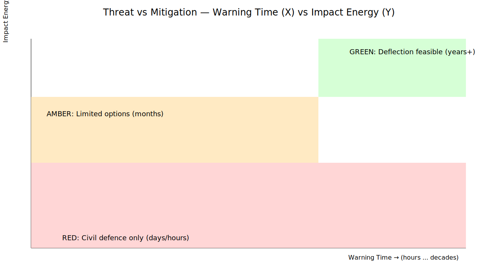

# CADI — CoCivium Asteroid Defence Initiative

**Aim:** open models + governance to plan detection, deflection/disruption, and civil defence — before the crisis clock starts.

## Threat vs Mitigation (headline graphic)

**Axes**: X = Warning Time (hours → decades), Y = Impact Energy (local → global).  
- Green: realistic deflection (years+).  
- Amber: limited options (months).  
- Red: civil defence only (days/hours).

## What CADI will publish
- Open threat models contextualising Sentry/Scout/Torino/Palermo
- Deflection feasibility maps (kinetic, tugboat, nuclear policy-gated)
- Readiness dashboards (launch windows, comms templates, treaty scaffolds)
